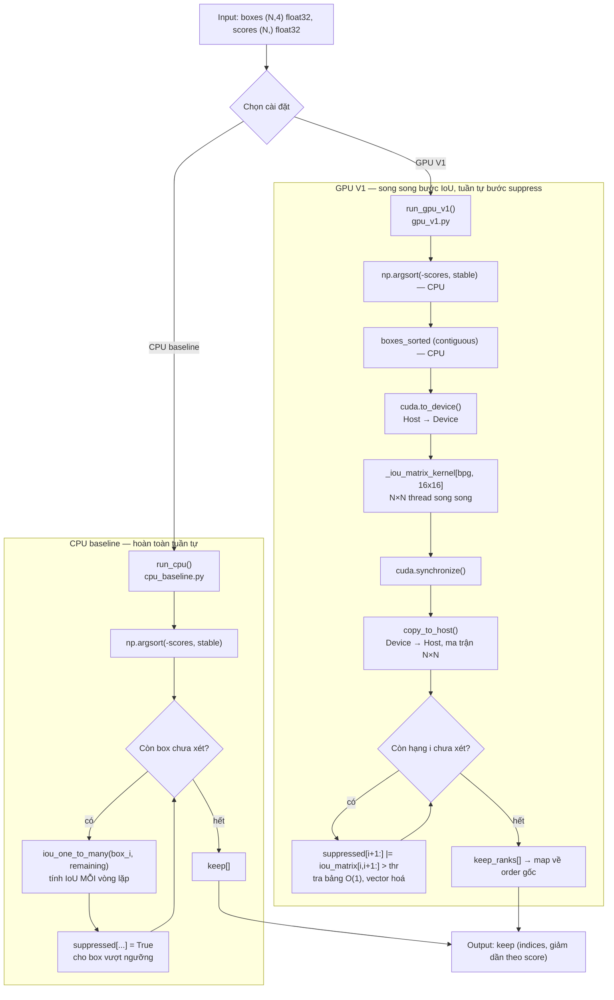
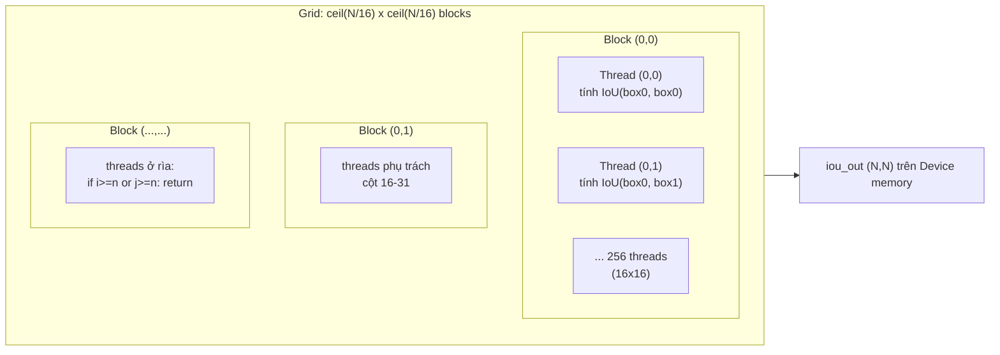
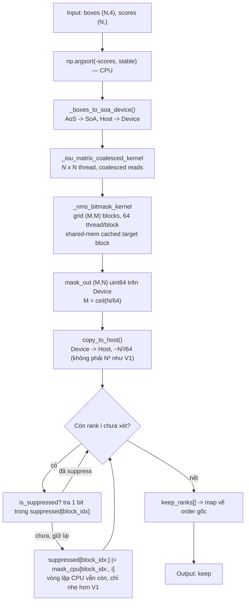
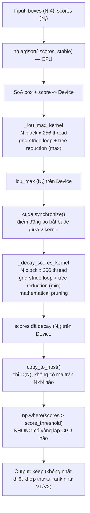

# Tài liệu kỹ thuật: cuda-nms-numba

> 🧭 Đây là tài liệu kỹ thuật chi tiết nhất trong repo. Nếu mới đọc lần đầu, nên bắt đầu từ **[docs/INDEX.md](INDEX.md)** (trang mục lục tổng, kiểu Obsidian vault) thay vì đọc thẳng file này từ đầu — INDEX.md sẽ dẫn đúng phần cần đọc theo mục đích của bạn. Các thuật ngữ kỹ thuật dùng trong tài liệu này được giải thích tập trung ở **[docs/GLOSSARY.md](GLOSSARY.md)**.
>
> **Phạm vi tài liệu**: Toàn bộ nội dung dưới đây được rút ra trực tiếp từ mã nguồn hiện có trong repo (`src/cpu_baseline.py`, `src/gpu_v1.py`, `src/gpu_v2.py`, `src/gpu_v3.py`, `tests/test_correctness.py`, và 4 notebook `src/*.ipynb`) và từ tài liệu đề xuất dự án (`CSC14116 - Proposal.docx`). Những số liệu benchmark được trích từ proposal hoặc từ output đã lưu thật sẽ được ghi rõ nguồn — tài liệu này không tự chạy lại benchmark hay bịa số liệu.
>
> **Trạng thái mã nguồn tại thời điểm cập nhật gần nhất**: cả 4 cài đặt — **CPU baseline**, **GPU V1**, **GPU V2** (coalesced SoA + bitmask suppression), **GPU V3** (Matrix NMS) — đều đã có code đầy đủ trong `src/`. CPU baseline và GPU V1 đã đo tốc độ thật trên Colab T4; GPU V2/V3 code đã xong và có test tự động nhưng **benchmark tốc độ thật trên GPU vẫn đang chờ chạy** — số liệu tốc độ V2/V3 trong tài liệu này được đánh dấu rõ `[kỳ vọng, chưa verify]` ở bất kỳ chỗ nào chưa có số đo thật. Xem trạng thái số liệu đầy đủ, cập nhật nhất tại [`presentation/README.md`](../presentation/README.md#trạng-thái-số-liệu--cái-gì-thật-cái-gì-đang-chờ).
>
> ⚠️ **Bản trước của tài liệu này** (trước khi V2/V3 có code) ghi rằng GPU V2/V3 "mới chỉ tồn tại dưới dạng kế hoạch trong proposal, chưa có code" — điều đó **không còn đúng**; cả hai đã được triển khai đầy đủ trong `src/gpu_v2.py` và `src/gpu_v3.py` (xem [mục 2.5](#25-gpu_v2py--giải-thích-từng-hàm-và-cuda-kernel), [mục 2.6](#26-gpu_v3py--giải-thích-từng-hàm-và-cuda-kernel)).

---

## Mục lục

1. [Phần 1 — Phân tích dự án](#phần-1--phân-tích-dự-án)
2. [Phần 2 — Giải thích kỹ thuật (dành cho người mới)](#phần-2--giải-thích-kỹ-thuật-dành-cho-người-mới)
3. [Phần 3 — Tài liệu kỹ thuật chi tiết](#phần-3--tài-liệu-kỹ-thuật-chi-tiết)

---

## Phần 1 — Phân tích dự án

### 1.1 Tổng quan dự án

`cuda-nms-numba` là đồ án môn **CSC14116 — Applied Parallel Programming** (chủ đề A4), do nhóm 11 thực hiện (Lê Quang Tân — 22127378, Phùng Quốc Tuấn — 19127616). Mục tiêu: tăng tốc thuật toán **Non-Maximum Suppression (NMS)** — một bước hậu xử lý bắt buộc trong các mô hình object detection (YOLO, SSD, Faster R-CNN...) — bằng GPU, sử dụng **Numba** (`@cuda.jit`) thay vì CUDA C/C++ thuần (đây là ràng buộc của môn học, xem `gpu_v1.py` dòng 1-23).

Repo hiện có 2 cài đặt độc lập, cùng interface (`(boxes, scores, iou_threshold) -> keep_indices`):

| Thành phần | File | Vai trò |
|---|---|---|
| CPU baseline | `src/cpu_baseline.py`, `src/cpu_baseline.ipynb` | Cài đặt tuần tự bằng NumPy — dùng làm mốc đúng-đắn (ground truth nội bộ) và mốc tốc độ để so sánh |
| GPU V1 | `src/gpu_v1.py`, `src/gpu_v1.ipynb` | Cài đặt GPU đầu tiên — tính ma trận IoU N×N song song trên GPU, phần suppression vẫn chạy trên CPU |
| Kiểm thử | `tests/test_correctness.py` | So khớp kết quả CPU/GPU với nhau và với `torchvision.ops.nms` (ground truth bên ngoài) |

### 1.2 Vấn đề cần giải quyết

Một detector như YOLO thường sinh ra **hàng nghìn box ứng viên** cho một ảnh, trong đó rất nhiều box trùng lặp lên cùng một vật thể với độ tin cậy (score) khác nhau. NMS có nhiệm vụ: giữ lại box có score cao nhất tại mỗi vị trí, loại bỏ các box "trùng" có IoU (độ chồng lấp) vượt ngưỡng so với box đã giữ.

Thuật toán NMS truyền thống (greedy NMS, cài trong `run_cpu` — `cpu_baseline.py:71-96`) là **tuần tự và có độ phức tạp O(n²)** trong trường hợp xấu nhất: với mỗi box được giữ, phải so IoU với toàn bộ box còn lại chưa bị loại.

> **Đính chính (đã đối chiếu lại với output thật đã lưu trong notebook)**: bản trước của tài liệu này trích số liệu "0.2846s / 65% suppression / 34% IoU" từ bản đề xuất (proposal) ban đầu — đó là số liệu **dự kiến trước khi chạy thật**, chưa từng khớp với bất kỳ lần chạy nào đã lưu trong repo. Bảng và tỉ lệ dưới đây lấy trực tiếp từ output đã lưu thật trong `cpu_baseline.ipynb`/`gpu_v1.ipynb` (chạy trên Colab), không phải số dự kiến.

Theo `benchmark()` đã chạy và lưu output thật trong `cpu_baseline.ipynb` (cell "Demo run + benchmark sweep"), thời gian chạy CPU baseline tăng gần bậc hai theo N:

| N | Thời gian CPU (đo thật, `cpu_baseline.ipynb`) |
|---|---|
| 100 | 0.0063 s |
| 1.000 | 0.0474 s |
| 10.000 | 1.8166 s |

Lưu ý: `gpu_v1.ipynb` đo lại CPU baseline trong cùng 1 lần chạy để so sánh trực tiếp với GPU V1, và ra số hơi khác (100→0.0069s, 1.000→0.1513s, 10.000→**2.4918s**) — chênh lệch giữa 2 lần đo là dao động bình thường của thời lượng Colab cấp phát (CPU/RAM không cố định giữa các phiên), không phải lỗi. Số ở slide "so tốc độ CPU vs GPU V1" (`presentation/OUTLINE_AND_CONTENT.md`) dùng cặp số từ `gpu_v1.ipynb` vì CPU và GPU được đo cùng 1 lần chạy, đảm bảo so sánh công bằng (cùng điều kiện máy).

Theo cell "Profiling" trong `cpu_baseline.ipynb` (cProfile thật ở N=10.000, `sort_stats("cumulative")`, chạy trên Colab): trong tổng thời gian tính toán thuần của thuật toán (loại trừ overhead đo đạc/IPython), hàm tính IoU (`iou_one_to_many`, gọi 6.100 lần) chiếm **tottime 0.837s (~65%)**, phần thân vòng lặp `run_cpu` (sort, bookkeeping suppression — không tính thời gian bên trong `iou_one_to_many`) chiếm **tottime 0.459s (~35%)**. Tỉ lệ 65/34% trùng hợp gần giống bản dự kiến cũ, nhưng **nhãn bị đảo ngược trong bản cũ** (bản cũ ghi 65% là suppression loop, 34% là IoU — thực tế IoU mới là phần chiếm nhiều hơn).

Đã chạy lại cProfile y hệt (cùng `N=10.000, seed=0`) trên máy local (Python 3.11.9, NumPy 1.26.4, Windows) để đối chiếu — kết quả lưu tại [`presentation/cprofile_N10000_local.txt`](../presentation/cprofile_N10000_local.txt): tổng **0.449s**, `run_cpu` tottime 0.266s (~59%), `iou_one_to_many` tottime 0.181s (~40%). Tỉ lệ đảo ngược nhẹ so với Colab (59/40 thay vì 35/65) — đây là khác biệt **phần cứng** (CPU máy local nhanh hơn cho phép NumPy vector hoá, khiến phần vòng lặp Python thuần tương đối chiếm tỉ trọng lớn hơn), không phải sai số đo. Kết luận không đổi ở cả 2 lần đo: **cả 2 phần đều chiếm tỉ trọng đáng kể, bản thân thuật toán NMS — không phải I/O — là bottleneck**.

Điều này càng củng cố động lực đưa NMS lên GPU: phần tính IoU giữa mọi cặp box — luôn chiếm tỉ trọng lớn ở cả 2 lần đo — cũng chính là phần **song song hoàn toàn (embarrassingly parallel)** — IoU(i, j) không phụ thuộc kết quả của bất kỳ cặp nào khác — trong khi phần quyết định "giữ hay loại" lại có **phụ thuộc tuần tự** (số phận của box B phụ thuộc việc box A điểm cao hơn đã được giữ hay chưa). Sự căng thẳng giữa hai đặc tính này là chủ đề xuyên suốt của cả dự án.

### 1.3 Kiến trúc hệ thống

```
cuda-nms-numba/
├── README.md                        # hướng dẫn cài đặt & chạy nhanh
├── requirements.txt                 # numpy, torch, torchvision, numba, pytest
├── CSC14116 - Proposal.docx         # đề xuất dự án (vấn đề, kế hoạch, phân công)
├── src/
│   ├── cpu_baseline.py              # NMS tuần tự, NumPy thuần (ground truth nội bộ)
│   ├── cpu_baseline.ipynb           # bản notebook (chạy trên Colab/Kaggle, không cần GPU)
│   ├── gpu_v1.py                    # GPU V1: kernel IoU N×N song song + suppression trên host
│   ├── gpu_v1.ipynb                 # bản notebook GPU V1 (cần GPU runtime)
│   ├── gpu_v2.py                    # GPU V2: coalesced SoA IoU kernel + bitmask suppression
│   ├── gpu_v2.ipynb                 # bản notebook GPU V2 (cần GPU runtime)
│   ├── gpu_v3.py                    # GPU V3: Matrix NMS (soft suppression, không còn CPU loop)
│   └── gpu_v3.ipynb                 # bản notebook GPU V3 (cần GPU runtime)
├── tests/
│   └── test_correctness.py          # đối chiếu CPU ↔ GPU V1 ↔ GPU V2 ↔ torchvision (V3: sanity check riêng)
├── presentation/                    # tài liệu chuẩn bị thuyết trình seminar — xem presentation/README.md
└── docs/
    ├── INDEX.md                     # 🧭 bắt đầu từ đây — mục lục tổng của cả repo
    ├── GLOSSARY.md                  # bảng thuật ngữ dùng chung
    ├── TECHNICAL_DOCUMENTATION.md   # tài liệu này
    └── HOW_TO_RUN.md                # hướng dẫn tự chạy code & test, không cần AI hỗ trợ
```

Cả 4 script (`cpu_baseline.py`, `gpu_v1.py`, `gpu_v2.py`, `gpu_v3.py`) đều có CLI riêng (`--n`, `--iou-threshold`, `--seed`, `--verify`, `--benchmark`) và đều gọi chung `load_data()` (định nghĩa trong `cpu_baseline.py`) để sinh dữ liệu tổng hợp giống hệt nhau — điều này đảm bảo khi so sánh tốc độ/độ chính xác giữa CPU và GPU, các bên xuất phát từ **cùng một tập input** (cùng seed). `gpu_v1.py` `import` trực tiếp `load_data` và `run_cpu` từ `cpu_baseline.py` để tái sử dụng logic; `gpu_v2.py` lại `import` thêm `run_gpu_v1` từ `gpu_v1.py` (dùng trong `--verify` để đối chiếu chéo cả 2 version GPU) — tránh trùng lặp code giữa các version.

---

## Phần 2 — Giải thích kỹ thuật (dành cho người mới)

### 2.1 NMS là gì?

Tưởng tượng bạn có một tấm ảnh con mèo, và bạn nhờ 100 người bạn cùng khoanh vòng tròn quanh con mèo đó. Có bạn khoanh sát, có bạn khoanh hơi lệch, có bạn tự tin nói "chắc chắn 95% đây là mèo", có bạn rụt rè nói "chắc khoảng 20% thôi". Kết quả là bạn có **100 vòng tròn chồng lên nhau** quanh cùng một con mèo — nhưng thực ra chỉ có **một** con mèo!

NMS giống như một "trọng tài" làm việc sau:
1. Xếp tất cả vòng tròn theo độ tự tin, từ cao xuống thấp.
2. Chọn vòng tròn tự tin nhất, giữ lại — "đây chắc chắn là câu trả lời tốt nhất".
3. Nhìn các vòng tròn còn lại: cái nào **chồng lên** vòng vừa giữ quá nhiều (chắc là đang khoanh cùng một con mèo) thì **loại bỏ**.
4. Lặp lại với vòng tròn tự tin nhất **tiếp theo** trong số còn sót lại, cho đến khi hết.

Kết quả cuối cùng: mỗi con mèo chỉ còn đúng một vòng tròn — vòng tự tin nhất.

**"Chồng lên nhau bao nhiêu" được đo bằng IoU** (Intersection over Union — Diện tích giao / Diện tích hợp). Hai vòng tròn giống hệt nhau → IoU = 1 (100% chồng). Hai vòng tròn không chạm nhau → IoU = 0.

**Vấn đề tốc độ**: nếu có 10.000 vòng tròn (trường hợp thật với ảnh nhiều vật thể), bước 3 phải so sánh vòng đang giữ với hàng nghìn vòng còn lại, lặp lại hàng nghìn lần → rất chậm nếu làm tuần tự trên CPU (một máy tính chỉ có vài "lõi" làm việc). Nhưng một GPU thì có **hàng nghìn "công nhân" nhỏ (thread)** có thể tính hàng nghìn cặp IoU **cùng một lúc**. Đó là lý do dự án này "mượn" GPU để làm nhanh bước tính IoU.

### 2.2 `cpu_baseline.py` — giải thích từng hàm

#### `load_data(n, seed=0)` — dòng 20-33
Sinh dữ liệu giả lập: `n` box ngẫu nhiên dạng `[x1, y1, x2, y2]` (góc trên-trái, góc dưới-phải), toạ độ `x1, y1` trong khoảng `[0, 900]`, chiều rộng/cao `w, h` trong `[10, 100]`, và `n` điểm số (`scores`) ngẫu nhiên trong `[0, 1)`. Dùng `np.random.default_rng(seed)` nên **cùng seed → cùng dữ liệu**, giúp so sánh CPU/GPU công bằng.

#### `load_real_boxes(image_paths=None, conf_threshold=0.25)` — dòng 36-50
Thay vì dữ liệu giả, hàm này tải mô hình **YOLOv5s** đã huấn luyện sẵn qua `torch.hub.load`, chạy trên ảnh thật (mặc định là ảnh mẫu `zidane.jpg` của Ultralytics) để lấy box/score thực tế từ một detector thật.

#### `iou_one_to_many(box, boxes)` — dòng 53-68
Tính IoU giữa **một** box và **một mảng** M box khác, hoàn toàn bằng phép toán mảng NumPy (vector hoá — không có vòng lặp Python). Công thức:
- Toạ độ vùng giao: `xx1 = max(box.x1, boxes.x1)`, `yy1 = max(box.y1, boxes.y1)`, `xx2 = min(box.x2, boxes.x2)`, `yy2 = min(box.y2, boxes.y2)`.
- Diện tích giao: `inter = max(0, xx2-xx1) * max(0, yy2-yy1)` (kẹp về 0 nếu không chạm nhau).
- `IoU = inter / (area_box + area_boxes - inter)`, mẫu số được chặn dưới `1e-9` để tránh chia cho 0.

#### `run_cpu(boxes, scores, iou_threshold=0.5)` — dòng 71-96
Đây là **thuật toán NMS tham lam (greedy)** cốt lõi:
1. `order = np.argsort(-scores, kind="stable")` — sắp xếp chỉ số box theo score giảm dần; `kind="stable"` đảm bảo khi hai box có score bằng nhau, thứ tự gốc được giữ nguyên → **kết quả tất định (deterministic)**, không đổi giữa các lần chạy.
2. Duyệt tuần tự theo `order`. Nếu box hiện tại chưa bị suppress, **giữ lại** (`keep.append`), rồi tính IoU giữa nó và tất cả box còn lại **chưa bị suppress** (`remaining`), suppress những box có `iou > iou_threshold`.

Docstring của hàm (dòng 74-76) nói rõ: vòng lặp này **cố ý giữ tuần tự, không vector hoá** — vì chính sự phụ thuộc tuần tự này là thứ mà GPU V3 (Matrix NMS, kế hoạch) muốn loại bỏ. Đây là điểm thiết kế quan trọng: baseline không chỉ để đo tốc độ, mà còn minh hoạ đúng "vấn đề" mà cả dự án đang giải quyết.

#### `verify(boxes, scores, iou_threshold, keep)` — dòng 99-119
So sánh tập box giữ lại (`keep`) với kết quả của `torchvision.ops.nms` — một cài đặt NMS đã được kiểm chứng rộng rãi, dùng làm **ground truth bên ngoài**. Nếu không cài `torch`/`torchvision`, hàm bỏ qua kiểm tra thay vì lỗi cứng.

#### `benchmark(ns=(100, 1000, 10000), ...)` — dòng 122-134
Đo thời gian `run_cpu` với từng giá trị N trong `ns`, in bảng kết quả — chính là nguồn dữ liệu cho bảng "vấn đề cần giải quyết" ở mục 1.2.

### 2.3 `gpu_v1.py` — giải thích từng hàm và CUDA kernel

#### Trước tiên: CUDA kernel là gì? (giải thích đơn giản)

Một **CUDA kernel** giống như một "tờ hướng dẫn công việc" mà GPU phát cho **hàng nghìn công nhân (thread)** cùng lúc — mỗi công nhân đọc **cùng một tờ hướng dẫn**, nhưng mỗi người tự biết "tôi là công nhân số mấy" và chỉ làm phần việc của số đó. Trong `gpu_v1.py`, tờ hướng dẫn là: "tính độ chồng lấp (IoU) giữa box số `i` và box số `j`" — và có `N × N` công nhân, mỗi người phụ trách đúng một cặp `(i, j)`.

Các công nhân được tổ chức thành nhóm nhỏ gọi là **block** (ở đây mỗi block có `16 × 16 = 256` công nhân — dòng `_TPB = (16, 16)`, `gpu_v1.py:45`), và các block lại hợp thành một **grid** lớn phủ kín toàn bộ ma trận N×N.

#### `_iou_matrix_kernel(boxes, iou_out)` — `@cuda.jit`, dòng 52-82

```python
i, j = cuda.grid(2)          # "tôi là công nhân phụ trách ô (i, j)"
n = boxes.shape[0]
if i >= n or j >= n:
    return                    # công nhân dư (do grid làm tròn lên) thì nghỉ
# ... tính IoU(boxes[i], boxes[j]) y hệt logic iou_one_to_many ...
iou_out[i, j] = inter / union if union > 1e-9 else 0.0
```

- `cuda.grid(2)` trả về toạ độ 2 chiều `(i, j)` duy nhất cho mỗi thread, tính từ `(block_id, thread_id_trong_block)` — công thức chuẩn của Numba CUDA, không cần tự viết tay.
- **Bounds guard** (`if i >= n or j >= n: return`) bắt buộc phải có vì số block được cấp luôn làm tròn **lên** (`ceil`), nên grid thực tế thường lớn hơn N một chút → một số thread ở "rìa" sẽ trỏ ra ngoài mảng nếu không được chặn.
- Công thức tính IoU **giống hệt** `iou_one_to_many` bên CPU (chỉ viết lại bằng scalar `max`/`min` thay vì NumPy vector, vì code chạy trong kernel không được gọi hàm NumPy) — đây là điểm quan trọng để đảm bảo hai cài đặt cho ra cùng kết quả số học, và chính là điều mà `test_gpu_v1_iou_matrix_matches_cpu` (trong `tests/test_correctness.py`) kiểm tra.
- Vì mọi ô `(i, j)` được tính **độc lập hoàn toàn** với mọi ô khác — không cần đồng bộ hoá (`cuda.syncthreads()`) giữa các thread — bài toán này thuộc dạng **embarrassingly parallel**, lý tưởng cho GPU.

#### `compute_iou_matrix_gpu(boxes)` — dòng 89-113
Hàm "chỉ huy" phía host (CPU), theo đúng khuôn mẫu lập trình CUDA:
1. `cuda.to_device(...)` — copy mảng box từ RAM (host) sang bộ nhớ GPU (device). Bắt buộc `np.ascontiguousarray` vì Numba CUDA yêu cầu bộ nhớ liền mạch kiểu C.
2. `cuda.device_array((n, n), ...)` — cấp phát sẵn vùng nhớ trên GPU cho ma trận kết quả (chưa copy dữ liệu gì, chỉ "đặt chỗ").
3. Tính `bpg` (blocks-per-grid) bằng công thức làm tròn lên chuẩn: `(n + TPB - 1) // TPB` theo mỗi chiều.
4. `_iou_matrix_kernel[bpg, _TPB](d_boxes, d_iou)` — cú pháp `kernel[grid, block](...)` của Numba, phát lệnh cho GPU chạy.
5. `cuda.synchronize()` — CPU **chờ** GPU làm xong hẳn (vì lệnh phát kernel là bất đồng bộ/non-blocking).
6. `copy_to_host()` — copy kết quả từ GPU về lại RAM.

#### `run_gpu_v1(boxes, scores, iou_threshold=0.5)` — dòng 116-165

Toàn bộ pipeline GPU V1, gồm 4 bước (đúng như docstring dòng 121-127):
1. **Sắp xếp theo score** (trên CPU, `np.argsort(-scores, kind="stable")`) — giống hệt bước đầu của `run_cpu`.
2. **Tải box đã sắp xếp lên GPU, tính ma trận IoU N×N** bằng `compute_iou_matrix_gpu`.
3. **Tải ma trận IoU về CPU.**
4. **Suppression tham lam vector hoá**:
   ```python
   for i in range(n):
       if suppressed[i]:
           continue
       keep_ranks.append(i)
       if i + 1 < n:
           suppressed[i + 1:] |= iou_matrix[i, i + 1:] > iou_threshold
   ```
   Vòng lặp `for i in range(n)` **vẫn tuần tự** (không thể tránh — đây chính là phần "phụ thuộc tuần tự" đã nói ở mục 1.2), nhưng bên trong, thay vì lặp Python qua từng box còn lại để so IoU, code dùng **một phép toán mảng NumPy duy nhất** (`suppressed[i+1:] |= iou_matrix[i, i+1:] > iou_threshold`) so sánh toàn bộ hàng `i` của ma trận đã tính sẵn cùng lúc. Comment trong code (dòng 159-161) gọi đây là "KEY FIX" — theo lịch sử commit (`3836ab6 fix(gpu_v1): replace nested Python suppression loop with vectorized NumPy`), bản đầu tiên dùng vòng lặp lồng nhau bằng Python thuần và rất chậm; bản hiện tại thay bằng slice NumPy chạy ở tốc độ C.

   Vì mọi IoU đã được GPU tính sẵn trong ma trận, bước này chỉ còn là **tra bảng O(1)** cho mỗi cặp thay vì tính lại IoU — khác biệt so với `run_cpu`, nơi IoU được tính lại (`iou_one_to_many`) mỗi vòng lặp.

#### `benchmark(...)` — dòng 172-206
So sánh thời gian `run_cpu` và `run_gpu_v1` với cùng dữ liệu. Có bước **"warm-up"** chạy thử trên N=10 trước khi đo — vì Numba biên dịch kernel **just-in-time (JIT)** ở lần gọi đầu tiên (tốn thời gian biên dịch, không liên quan tốc độ thực thi), nên phải "làm nóng" trước để phép đo phản ánh đúng tốc độ chạy, không lẫn thời gian compile.

### 2.4 Tại sao cần CUDA cho NMS? — Các quyết định thiết kế (design choices)

| Quyết định thiết kế | Lý do (dựa trên code/docstring) |
|---|---|
| Tính **toàn bộ** ma trận IoU N×N thay vì chỉ tính khi cần | Vì bước tính IoU là phần **song song hoàn toàn**, dồn hết phần này cho GPU tận dụng tối đa hàng nghìn thread; đổi lại suppression chỉ còn là tra bảng O(1) trên CPU (`gpu_v1.py:1-15`). |
| Sắp xếp theo score **trước khi** đưa lên GPU | Suppression cần duyệt theo thứ tự score giảm dần; sắp xếp trước giúp hàng `i` của ma trận IoU tương ứng đúng thứ hạng `i`, nên vòng lặp suppression chỉ cần chỉ số liên tiếp (`i+1:`), không cần tra cứu gián tiếp qua `order` mỗi bước. |
| `_TPB = (16, 16)` = 256 threads/block | Comment trong code gọi đây là "a common sweet spot for 2-D grid kernels" — 256 threads là bội số của warp size (32) trên GPU NVIDIA, giúp tận dụng tốt phần cứng mà không cần tinh chỉnh riêng cho từng GPU. |
| Suppression vẫn chạy trên **CPU**, không đưa lên GPU ở V1 | Đây là giới hạn cố ý của "V1" (naive): suppression có phụ thuộc tuần tự (box sau phụ thuộc quyết định của box trước) nên khó song song hoá đơn giản — GPU V2 (bitmask + parallel reduction, [mục 2.5](#25-gpu_v2py--giải-thích-từng-hàm-và-cuda-kernel)) và V3 (Matrix NMS, loại bỏ hẳn phụ thuộc tuần tự bằng soft-suppression, [mục 2.6](#26-gpu_v3py--giải-thích-từng-hàm-và-cuda-kernel)) tấn công đúng giới hạn này theo 2 cách khác nhau. |
| Dùng **Numba `@cuda.jit`**, không viết CUDA C/C++ | Ràng buộc của môn học (ghi rõ trong proposal: "Numba (`@cuda.jit`) — course's official GPU tool, no raw CUDA C/C++"), đồng thời giữ code Python thuần, dễ đọc, dễ so sánh trực tiếp với công thức NumPy ở bản CPU. |
| Cùng công thức IoU viết lại 2 lần (`iou_one_to_many` và trong kernel) thay vì dùng chung 1 hàm | Code chạy **bên trong** kernel CUDA (`@cuda.jit`) bị giới hạn tập lệnh (không gọi được hàm NumPy cấp cao, chỉ dùng scalar operations như `max`/`min` mà Numba biên dịch được sang GPU) nên không thể tái sử dụng trực tiếp hàm NumPy của CPU. |
| V2 đổi box từ **AoS sang SoA** (`x1,y1,x2,y2` là 4 mảng riêng thay vì 1 mảng `(N,4)` gộp) | Thread liền kề trong cùng warp đọc ô nhớ liền kề nhau → gộp thành 1 giao dịch bộ nhớ (**coalesced access**) thay vì nhiều giao dịch rời rạc như layout gộp của V1 — xem [Glossary mục C](GLOSSARY.md#c-kỹ-thuật-tối-ưu-bộ-nhớ--song-song-hoá-v2v3). |
| V2 nén suppression thành **bitmask 64-bit** thay vì tải cả ma trận IoU | Giảm dữ liệu tải Host↔Device từ O(n²) (ma trận float32 đầy) xuống O(n²/64) (bitmask) — 64 lần nhỏ hơn, không phải "loại bỏ hoàn toàn" như module docstring từng ghi nhầm (đã sửa, xem [mục 2.5](#25-gpu_v2py--giải-thích-từng-hàm-và-cuda-kernel)). |
| V3 đổi hẳn thuật toán sang **Matrix NMS / soft suppression** thay vì tiếp tục tối ưu phần cứng | GPU V2 vẫn giữ bản chất Greedy NMS (suppression vẫn có 1 vòng lặp CPU nhẹ, xem [mục 2.5](#25-gpu_v2py--giải-thích-từng-hàm-và-cuda-kernel)) — chỉ đổi thuật toán (giảm điểm dần thay vì loại hẳn) mới bỏ được hoàn toàn phụ thuộc tuần tự, cho phép 100% song song trên GPU (Wang et al., 2020; xem [mục 2.6](#26-gpu_v3py--giải-thích-từng-hàm-và-cuda-kernel)). |
| V3 dùng **1D grid (N block, 256 thread/block)** thay vì 2D N×N như V1/V2 | Không cần ma trận IoU N×N nào cả (mỗi block tự tính `iou_max`/decay cho đúng 1 box bằng vòng lặp grid-stride nội bộ) — vừa tránh giới hạn kích thước grid 2D (`gridDim.y` tối đa 65.535 block trên nhiều kiến trúc GPU), vừa tránh cấp phát bộ nhớ O(n²). |

### 2.5 `gpu_v2.py` — giải thích từng hàm và CUDA kernel

V2 tấn công đúng 2 điểm yếu của V1 đã nêu ở mục 2.4: (1) cách đọc bộ nhớ không liền mạch, (2) phải tải cả ma trận IoU N×N về CPU.

#### `_iou_matrix_coalesced_kernel(x1, y1, x2, y2, iou_out)` — `@cuda.jit`, `gpu_v2.py:86-126`

Gần như giống hệt `_iou_matrix_kernel` của V1 (cùng công thức IoU, cùng bounds guard), chỉ khác **cách nhận toạ độ box**: thay vì 1 mảng `boxes[N,4]` gộp (AoS — Array of Structures), V2 nhận 4 mảng riêng `x1[N], y1[N], x2[N], y2[N]` (SoA — Structure of Arrays, xem [Glossary mục C](GLOSSARY.md#c-kỹ-thuật-tối-ưu-bộ-nhớ--song-song-hoá-v2v3)). Lý do: với AoS, thread `i` đọc `boxes[i, 0]` cách thread `i+1` đọc `boxes[i+1, 0]` một khoảng 16 byte (4 số float32/box) — không liền mạch. Với SoA, thread `i` đọc `x1[i]` cách thread `i+1` đọc `x1[i+1]` đúng 4 byte liền kề — GPU gộp lại thành 1 giao dịch bộ nhớ 128-byte cho cả warp 32 thread thay vì nhiều giao dịch rời rạc (**coalesced memory access**).

#### `_nms_bitmask_kernel(x1, y1, x2, y2, mask_out, n, iou_threshold)` — `@cuda.jit`, `gpu_v2.py:133-215`

Đây là kernel quan trọng nhất của V2 — thay vì tải cả ma trận IoU N×N số thực (như V1), kernel này tính thẳng ra **bitmask suppression**: với mỗi box `i`, xác định nó suppress những box nào (trong số các box điểm thấp hơn) và nén kết quả đó thành các số nguyên 64-bit.

- **Tổ chức grid**: 2D, `bx = blockIdx.x` là "khối 64 box" chứa box neo `i` (`i = bx*64 + tx`), `by = blockIdx.y` là "khối 64 box mục tiêu" đang xét. `if by < bx: return` bỏ qua sớm các khối chắc chắn không cần tính, vì box `i` chỉ có thể suppress box điểm thấp hơn nó (chỉ số lớn hơn, tức nằm ở khối `by >= bx`).
- **Shared memory caching**: mỗi block nạp 64 box của khối cột `by` vào shared memory (`sx1, sy1, sx2, sy2`) một lần duy nhất, rồi mọi thread trong block cùng đọc lại từ đó — tránh đọc lại global memory 64 lần cho mỗi thread.
- **Kết quả**: `mask_out[by, i]` là 1 số uint64, bit thứ `k` bật (`1`) nghĩa là "box `i` suppress box thứ `(by*64 + k)`".

#### `run_gpu_v2(boxes, scores, iou_threshold=0.5)` — `gpu_v2.py:262-319`

Pipeline 5 bước:
1. Sắp xếp theo score (CPU, giống hệt V1).
2. Chuyển box đã sắp xếp sang SoA rồi tải lên GPU (`_boxes_to_soa_device`).
3. Cấp phát bitmask `(ceil(N/64), N)` uint64 trên GPU — **không cần zero-fill từ host** (xem bước 5, đây là điểm đã sửa: bản trước tạo mảng zero trên host rồi upload, tốn thêm 1 lượt truyền O(n²/64) không cần thiết).
4. Chạy `_nms_bitmask_kernel`, tải bitmask về CPU (~12.5MB ở N=10.000, so với ~400MB của ma trận IoU đầy ở V1 — giảm 64 lần, không phải "loại bỏ hoàn toàn" PCIe cost).
5. **Vòng lặp CPU cuối cùng** (vẫn tuần tự, đây là phần Greedy NMS chưa loại bỏ được): với mỗi box `i` theo thứ tự score giảm dần, kiểm tra đã bị suppress chưa (tra 1 bit trong `suppressed[block_idx]`); nếu chưa, giữ lại rồi OR bitmask của nó vào trạng thái `suppressed` — nhưng **chỉ OR từ hàng `block_idx` trở đi** (`suppressed[block_idx:] |= mask_cpu[block_idx:, i]`), vì kernel chỉ ghi các hàng `by >= bx`, hàng trước đó chưa từng được ghi và không bao giờ cần đọc.

> **V2 có loại bỏ hoàn toàn vòng lặp CPU không? Không.** Bước 5 vẫn là `for i in range(n)` bằng Python — nhẹ hơn nhiều so với V1 (mỗi lần chỉ OR 2 mảng ngắn ~N/64 phần tử thay vì so sánh cả hàng N phần tử), nhưng vẫn là 1 vòng lặp tuần tự thật sự (quyết định về box `i` phụ thuộc mọi box điểm cao hơn đã xử lý trước đó). Đây chính là động lực cho V3 (mục 2.6) — đổi hẳn thuật toán để bỏ hoàn toàn vòng lặp này.

### 2.6 `gpu_v3.py` — giải thích từng hàm và CUDA kernel

V3 không tối ưu thêm cách làm của Greedy NMS — nó **đổi hẳn thuật toán** sang Matrix NMS (Wang et al., 2020), loại bỏ hoàn toàn vòng lặp CPU còn sót lại ở V2.

#### `_iou_max_kernel(x1, y1, x2, y2, iou_max_out, n)` — `@cuda.jit(fastmath=True)`, `gpu_v3.py:60-113`

Một block (256 thread) phụ trách đúng 1 box `i`, tính `iou_max_out[i]` = IoU lớn nhất giữa box `i` và **bất kỳ box nào điểm cao hơn nó** (chỉ số nhỏ hơn `i`, vì box đã sắp theo score giảm dần).

- **Grid-stride loop**: với tối đa `i` box điểm cao hơn cần so sánh, 256 thread trong block chia nhau quét: thread `tx` xét các chỉ số `tx, tx+256, tx+512, ...` — giữ cả 256 thread bận việc bất kể `i` lớn hay nhỏ.
- **Tree reduction (parallel reduction)**: sau khi mỗi thread có 1 giá trị max cục bộ, cần gộp 256 giá trị đó thành 1 giá trị max chung của cả block. Cách làm: ghi vào mảng shared memory `s_max[256]`, rồi lặp giảm dần `stride` (128 → 64 → ... → 1), mỗi bước so sánh cặp cách nhau `stride` và giữ giá trị lớn hơn, có `cuda.syncthreads()` giữa các bước để đảm bảo mọi thread thấy được kết quả bước trước trước khi đọc. Sau bước cuối, `s_max[0]` là max của cả block.

#### `_decay_scores_kernel(x1, y1, x2, y2, scores, iou_max, n, method, sigma)` — `@cuda.jit(fastmath=True)`, `gpu_v3.py:117-192`

Một block phụ trách đúng 1 box `j`, nhân `scores[j]` với hệ số suy giảm (**decay factor**) nhỏ nhất trong số các hệ số mà từng box điểm cao hơn `j` (chỉ số `i < j`) đóng góp — đây chính là bước "soft suppression": giảm điểm thay vì xoá hẳn.

- Yêu cầu `_iou_max_kernel` đã chạy xong cho **mọi** box trước khi kernel này bắt đầu (`cuda.synchronize()` giữa 2 lần gọi kernel trong `run_gpu_v3_matrix_nms`) — đây là điểm đồng bộ bắt buộc duy nhất giữa 2 giai đoạn của thuật toán, nhưng ở quy mô toàn kernel chứ không phải bên trong 1 kernel.
- **Mathematical pruning** (comment gốc trong code): theo công thức Matrix NMS, decay chỉ nhỏ hơn 1 khi `IoU(i, j) > iou_max[i]`. Code kiểm tra điều kiện rẻ này trước, chỉ tính `exp()`/phép chia (đắt) khi thật sự cần — bỏ qua phần lớn cặp không ảnh hưởng.
- 2 công thức decay: `method="linear"` (giảm tuyến tính theo tỉ lệ IoU) hoặc `method="gaussian"` (giảm theo hàm mũ, tham số độ mượt `sigma`).
- Cùng kiểu tree reduction như `_iou_max_kernel`, nhưng gộp về **min** thay vì max (decay cuối của box `j` là decay **nhỏ nhất/nghiêm khắc nhất** trong số mọi box điểm cao hơn nó — 1 chồng lấp mạnh là đủ để suppress).

#### `run_gpu_v3_matrix_nms(boxes, scores, score_threshold=0.05, method="gaussian", sigma=2.0)` — `gpu_v3.py:169-205`

Pipeline: sắp xếp theo score (CPU) → tải box + score lên GPU (SoA, giống V2) → chạy `_iou_max_kernel` → `cuda.synchronize()` → chạy `_decay_scores_kernel` → tải score đã giảm về CPU → **`np.where(final_scores > score_threshold)`** chọn box giữ lại.

Khác biệt căn bản so với V1/V2: **không còn vòng lặp CPU nào cả**. Cả 2 kernel chạy song song hoàn toàn cho mọi box cùng lúc; quyết định "giữ hay loại" cuối cùng là so sánh ngưỡng điểm số (`score_threshold`), không phải duyệt tuần tự theo rank như Greedy NMS. Đây cũng là lý do **tập box V3 giữ lại không khớp y hệt CPU baseline/V1/V2** khi so theo index — V3 trả lời câu hỏi "điểm tin cậy còn lại sau khi trừ hao phần chồng lấp là bao nhiêu", không phải "giữ hay loại theo đúng thứ tự rank" — một đánh đổi thiết kế có chủ đích, không phải bug (xem `presentation/QA_PREP.md` mục F).

---

## Phần 3 — Tài liệu kỹ thuật chi tiết

### 3.1 Sơ đồ luồng dữ liệu

**Sơ đồ 1 — Luồng xử lý tổng thể (so sánh CPU baseline và GPU V1):**



**Sơ đồ 2 — Phân cấp thread trong `_iou_matrix_kernel` (giải thích trực quan grid/block/thread):**



### 3.2 Phân tích độ phức tạp thuật toán (Big-O)

| Cài đặt | Bước | Độ phức tạp thời gian | Ghi chú |
|---|---|---|---|
| **CPU baseline** (`run_cpu`) | Sort | O(n log n) | `np.argsort` |
| | Vòng lặp suppression | **O(n²)** trường hợp xấu nhất (không box nào bị loại) | Với mỗi box giữ, `iou_one_to_many` chạy trên toàn bộ `remaining` (tối đa O(n)); tổng cộng ≤ n vòng × O(n) = O(n²). Trường hợp tốt (nhiều box bị loại sớm) nhanh hơn nhiều trong thực tế — đây chính là điều bảng benchmark trong proposal thể hiện (tăng gần bậc hai nhưng không hoàn toàn tuyến tính bậc 2 tuyệt đối). |
| | **Tổng** | **O(n²)**, tuần tự (1 lõi) | |
| **GPU V1** (`run_gpu_v1`) | Sort | O(n log n) | CPU, giống baseline |
| | Kernel `_iou_matrix_kernel` | O(n²) công việc, nhưng chạy **song song** trên p thread cùng lúc → thời gian thực tế ≈ O(n²/p) (p = số thread phần cứng khả dụng, giới hạn bởi số CUDA core) | Đây là điểm mạnh chính của GPU V1. |
| | Truyền dữ liệu Host↔Device | O(n) lên (boxes), **O(n²) xuống** (ma trận IoU đầy đủ) | Xem mục 3.3 — đây là **bottleneck thực sự** ở N lớn. |
| | Vòng lặp suppression trên host | O(n) lần lặp × tra bảng vector hoá O(n) mỗi lần (broadcast NumPy) = **O(n²)** tổng, nhưng chạy ở tốc độ C (vector hoá) thay vì tốc độ Python thông dịch từng phần tử | Không còn gọi lại `iou_one_to_many` — đây là khác biệt cốt lõi so với baseline. |
| | **Tổng** | Tính toán O(n²/p) + truyền dữ liệu O(n²) + suppression O(n²) tốc độ C | Về mặt Big-O "hình thức", GPU V1 **không đổi bậc phức tạp** (vẫn O(n²)) — điểm cải thiện thực sự nằm ở **hằng số** (song song hoá phần tính toán nặng nhất, và thay Python loop bằng C-speed broadcast), không phải đổi từ O(n²) sang O(n log n). |
| **GPU V2** (`run_gpu_v2`) | Sort | O(n log n) | CPU, giống baseline |
| | Kernel IoU coalesced + bitmask | O(n²) công việc song song → O(n²/p) thời gian thực tế, hằng số nhỏ hơn V1 nhờ coalesced access | `_iou_matrix_coalesced_kernel` + `_nms_bitmask_kernel`, mục 2.5 |
| | Truyền dữ liệu Host↔Device | O(n) lên, **O(n²/64) xuống** (bitmask, không phải O(n) như module docstring từng ghi nhầm) | Giảm 64 lần so với V1, không phải loại bỏ hoàn toàn |
| | Vòng lặp OR-reduction trên host | **O(n²/64)** tổng (n lần lặp × O(n/64) mỗi lần) — vẫn tuần tự về bản chất | Nhẹ hơn V1 (O(n²)) nhưng **không phải O(n)** — đây vẫn là 1 vòng Python thật |
| | **Tổng** | Vẫn O(n²) hình thức, nhưng hằng số nhỏ hơn V1 ở cả 3 khâu (tính toán, truyền dữ liệu, suppression) | Không đổi bậc phức tạp, giống V1 — chỉ V3 (dưới) mới đổi bản chất bài toán |
| **GPU V3** (`run_gpu_v3_matrix_nms`) | Sort | O(n log n) | CPU, giống baseline |
| | Kernel `_iou_max_kernel` | O(n²) công việc (mỗi box `i` quét tối đa `i` box) song song trên N block × 256 thread → O(n²/(N·256)) thời gian thực tế | mục 2.6 |
| | Kernel `_decay_scores_kernel` | Tương tự, O(n²) công việc song song | mục 2.6 |
| | Truyền dữ liệu Host↔Device | O(n) cả 2 chiều (chỉ box/score/iou_max theo box, không có ma trận N×N nào) | Không còn thành phần O(n²) nào trong truyền dữ liệu — khác biệt lớn nhất so với V1/V2 |
| | Vòng lặp CPU | **Không có** — quyết định giữ/loại chỉ là `np.where(scores > threshold)`, O(n) vector hoá | Đây là điểm khác biệt cốt lõi: V3 loại bỏ hoàn toàn phần tuần tự, không chỉ làm nó rẻ hơn như V2 |
| | **Tổng** | Vẫn O(n²) công việc tính toán (không giảm bậc), nhưng **không còn phần nào chạy tuần tự trên CPU** | V3 không đổi Big-O của phần tính toán so với V1/V2, nhưng đổi *cấu trúc* bài toán: loại bỏ hẳn chuỗi phụ thuộc tuần tự, không chỉ chia nhỏ công việc |

> **Lưu ý quan trọng**: các dòng liên quan tới V1/V2/V3 ở trên là phân tích lý thuyết dựa trên cấu trúc code. CPU baseline và GPU V1 đã có số đo thật trên Colab T4 (xem `presentation/README.md` mục "Trạng thái số liệu"); GPU V2/V3 **code đã xong nhưng benchmark tốc độ thật vẫn đang chờ chạy** — số liệu tốc độ cụ thể nên lấy từ chạy `python src/gpu_v2.py --benchmark` / `python src/gpu_v3.py --benchmark` trên máy có GPU, hoặc notebook tương ứng (Colab/Kaggle GPU runtime).

### 3.3 Ghi chú hiệu năng (performance bottlenecks) và lưu ý khi mở rộng

1. **Bộ nhớ ma trận IoU tăng theo O(n²) — giới hạn cứng của thiết kế V1.**
   `compute_iou_matrix_gpu` cấp phát `cuda.device_array((n, n), dtype=np.float32)` (`gpu_v1.py:104`). Với N = 10.000 → 10.000² × 4 byte ≈ **400 MB** — vẫn chấp nhận được trên GPU hiện đại. Nhưng với N = 100.000 (không hiếm nếu batch nhiều ảnh cùng lúc) → 100.000² × 4 byte ≈ **40 GB**, vượt xa VRAM của hầu hết GPU miễn phí (Colab T4 có 16 GB). Đây là lý do rõ ràng nhất **tại sao thiết kế "tính toàn bộ ma trận" không mở rộng (scale) được lên N rất lớn** — bất kỳ ai định tăng N trong benchmark cần lưu ý giới hạn này trước.

2. **Truyền dữ liệu Host↔Device (PCIe) trở thành bottleneck ở N lớn.**
   Bước `copy_to_host()` phải chuyển toàn bộ ma trận N×N từ VRAM GPU về RAM CPU qua bus PCIe — băng thông PCIe thấp hơn nhiều so với băng thông bộ nhớ GPU nội bộ. Vì kích thước dữ liệu truyền tăng O(n²) trong khi công việc tính toán trên GPU giảm theo O(n²/p) (càng nhiều thread thì càng nhanh), ở N đủ lớn, **thời gian chờ truyền dữ liệu có thể vượt qua thời gian tính toán thực tế** — một dạng bottleneck "memory-bound" kinh điển của lập trình GPU.

3. **Vòng lặp suppression trên host (`run_gpu_v1`) vẫn là `for i in range(n)` bằng Python.**
   Dù mỗi bước đã được vector hoá (không lặp Python bên trong), vòng lặp **ngoài** vẫn chạy tuần tự qua tối đa N hạng, mỗi lần gọi một phép slice NumPy riêng — với N rất lớn, overhead gọi hàm Python lặp lại N lần cũng đáng kể. **GPU V2** (bitmask + parallel reduction, mục 2.5) làm vòng lặp này rẻ hơn nhiều (OR 2 mảng ngắn ~N/64 phần tử thay vì so cả hàng N phần tử) nhưng **không loại bỏ được nó** — vẫn còn 1 vòng Python tuần tự thật sự. **GPU V3** (Matrix NMS, mục 2.6) mới là bản loại bỏ hoàn toàn vòng lặp CPU, bằng cách đổi hẳn thuật toán (soft suppression/decay factor theo Wang et al. 2020) thay vì tối ưu thêm phần cứng.

4. **Chi phí biên dịch JIT ở lần gọi đầu tiên.**
   Numba biên dịch kernel `@cuda.jit` **lần đầu tiên nó được gọi** với một signature (kiểu dữ liệu) cụ thể — không phải lúc import module. Cả `benchmark()` (dòng 182-184) và `main()` (dòng 229-230) trong `gpu_v1.py` đều chủ động "warm up" bằng một lần gọi nhỏ trước khi đo thời gian thật — **bất kỳ ai viết benchmark mới cho project này cần làm tương tự**, nếu không, lần đo đầu tiên sẽ bị lẫn thời gian compile, làm sai lệch kết quả (nhìn như GPU chậm hơn thực tế, đặc biệt rõ ở N nhỏ).

5. **`cuda.synchronize()` là điểm đồng bộ bắt buộc.**
   Lệnh phát kernel (`_iou_matrix_kernel[bpg, _TPB](...)`) không chặn (non-blocking) — CPU tiếp tục chạy code sau đó ngay lập tức trong khi GPU vẫn đang tính. Nếu thiếu `cuda.synchronize()` trước `copy_to_host()`, có nguy cơ đọc dữ liệu **chưa được ghi xong** (race condition). Đây là điểm dễ mắc lỗi nhất khi mở rộng thêm kernel mới cho V2/V3.

6. **Chưa có xử lý batch (nhiều ảnh cùng lúc) ở bất kỳ version nào.**
   Catalog đề tài A4 đặt mục tiêu benchmark với "batch size 32", nhưng cả 4 file trong `src/` hiện chỉ xử lý **một tập box duy nhất** mỗi lần gọi (không có chiều batch). Lưu ý: tên hàm/kernel "batched" trong `gpu_v2.py` (`_nms_bitmask_kernel`, tiêu đề module "Batched NMS & Hardware Optimization") nói về việc **gom 64 box/khối để nén bitmask** — một khái niệm "batch" hoàn toàn khác, không phải batch size 32 của catalog. Bổ sung chiều batch thật (ví dụ thêm 1 chiều `cuda.grid(3)` hoặc xử lý tuần tự từng ảnh trong batch) vẫn là một thay đổi kiến trúc còn thiếu, không phải chỉ tối ưu nhỏ.

7. **V2's bitmask buffer từng bị zero-fill từ host một cách không cần thiết (đã sửa).**
   `run_gpu_v2` từng tạo mảng `(M, n)` uint64 toàn số 0 trên host rồi upload lên GPU trước khi chạy kernel, để tránh đọc phải bộ nhớ chưa khởi tạo. Nhưng vòng lặp OR-reduction ở host (bước 5, mục 2.5) trên thực tế **chỉ đọc các hàng mà kernel có ghi** (`by >= bx`) — các hàng còn lại không bao giờ được đọc, nên không cần zero-fill từ đầu. Việc zero-fill đó vô tình tạo thêm 1 lượt truyền O(n²/64) qua PCIe — cùng bậc với chính phần download sau đó — mâu thuẫn với chính mục tiêu thiết kế của V2 ("giảm PCIe traffic"). Đã sửa bằng cách bỏ hẳn bước zero-fill và thu hẹp vòng OR-reduction chỉ đọc từ hàng `block_idx` trở đi.

8. **`fastmath=True` ở V3 đánh đổi độ chính xác lấy tốc độ.**
   `_iou_max_kernel`/`_decay_scores_kernel` bật cờ này, cho phép trình biên dịch dùng phép toán gần đúng/nhanh hơn — có thể cho kết quả hơi khác biệt (vài ULP) giữa các lần chạy hoặc giữa các kiến trúc GPU khác nhau. Chấp nhận được vì dự án đã dùng dung sai `1e-4` khi so khớp IoU, và V3 vốn đã dùng tiêu chí ngưỡng điểm số (không so khớp index tuyệt đối như V1/V2).

9. **V3 dùng grid 1D (N block) thay vì 2D (N×N block như V1/V2) — vừa tránh giới hạn kích thước grid, vừa không cần ma trận N×N.**
   Grid 2D của V1/V2 bị giới hạn bởi `gridDim.y` tối đa 65.535 block trên nhiều kiến trúc GPU — với block 16×16, giới hạn đó tương ứng N ≈ 1.048.560 box (chưa chạm tới ở N=10.000 hiện tại, nhưng là giới hạn cứng nếu mở rộng benchmark lên N rất lớn). Thiết kế 1D của V3 (N block, mỗi block tự quét grid-stride nội bộ) không có giới hạn này, đồng thời không cần cấp phát ma trận IoU N×N nào cả.

### 3.4 Bảng thuật ngữ (Glossary)

Xem **[docs/GLOSSARY.md](GLOSSARY.md)** — đã tách thành file riêng để dễ tra cứu và liên kết từ nhiều tài liệu khác (kể cả `presentation/*.md`), thay vì lặp lại/nhân bản định nghĩa ở nhiều nơi.

### 3.5 Sơ đồ luồng dữ liệu — GPU V2



So với [Sơ đồ 1 ở mục 3.1](#31-sơ-đồ-luồng-dữ-liệu) (V1): khác ở 2 chỗ — SoA thay AoS trước khi lên GPU, và tải về **bitmask nén** thay vì ma trận IoU đầy. Vòng lặp CPU cuối (`H`→`I`→`J`) vẫn tồn tại y hệt về bản chất tuần tự, chỉ rẻ hơn.

### 3.6 Sơ đồ luồng dữ liệu — GPU V3



Khác biệt căn bản so với [Sơ đồ 1](#31-sơ-đồ-luồng-dữ-liệu) (V1) và [Sơ đồ V2](#35-sơ-đồ-luồng-dữ-liệu--gpu-v2) ở trên: hoàn toàn **không có bước nào chạy tuần tự trên CPU** sau khi dữ liệu đã lên GPU — bước cuối chỉ là so ngưỡng vector hoá, không phải vòng lặp theo rank.
