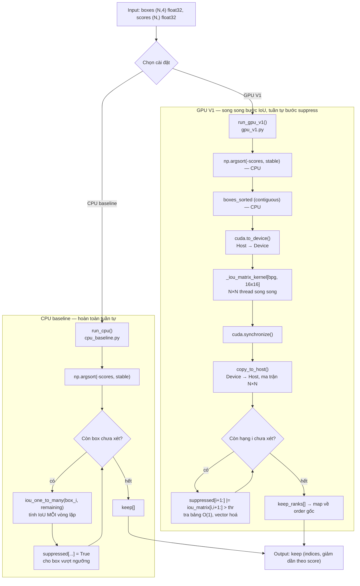
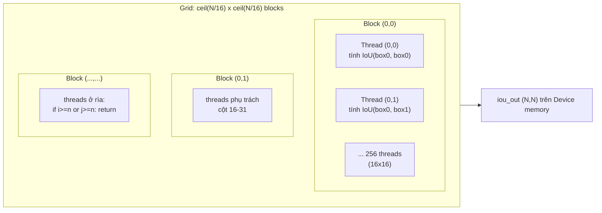

# Tài liệu kỹ thuật: cuda-nms-numba

> **Phạm vi tài liệu**: Toàn bộ nội dung dưới đây được rút ra trực tiếp từ mã nguồn hiện có trong repo (`src/cpu_baseline.py`, `src/gpu_v1.py`, `tests/test_correctness.py`, `src/cpu_baseline.ipynb`, `src/gpu_v1.ipynb`) và từ tài liệu đề xuất dự án (`CSC14116 - Proposal.docx`). Những số liệu benchmark được trích từ proposal sẽ được ghi rõ nguồn — tài liệu này không tự chạy lại benchmark hay bịa số liệu.
>
> **Trạng thái mã nguồn tại thời điểm viết tài liệu**: đã có **CPU baseline** và **GPU V1**. **GPU V2** (batched NMS + parallel reduction) và **GPU V3** (Matrix NMS) mới chỉ tồn tại dưới dạng kế hoạch trong proposal, chưa có code — phần nào trong tài liệu này nói về V2/V3 sẽ được đánh dấu rõ là "kế hoạch", không phải mã đã triển khai.

---

## Mục lục

1. [Phần 1 — Phân tích dự án](#phần-1--phân-tích-dự-án)
2. [Phần 2 — Giải thích kỹ thuật (dành cho người mới)](#phần-2--giải-thích-kỹ-thuật-dành-cho-người-mới)
3. [Phần 3 — Tài liệu kỹ thuật chi tiết](#phần-3--tài-liệu-kỹ-thuật-chi-tiết)

---

## Phần 1 — Phân tích dự án

### 1.1 Tổng quan dự án

`cuda-nms-numba` là đồ án môn **CSC14116 — Applied Parallel Programming** (chủ đề A4), do nhóm 11 thực hiện (Lê Quang Tân — 22127378, Phùng Quốc Tuấn — 19127616). Mục tiêu: tăng tốc thuật toán **Non-Maximum Suppression (NMS)** — một bước hậu xử lý bắt buộc trong các mô hình object detection (YOLO, SSD, Faster R-CNN...) — bằng GPU, sử dụng **Numba** (`@cuda.jit`) thay vì CUDA C/C++ thuần (đây là ràng buộc của môn học, xem `gpu_v1.py` dòng 1-23).

Repo hiện có 2 cài đặt độc lập, cùng interface (`(boxes, scores, iou_threshold) -> keep_indices`):

| Thành phần | File | Vai trò |
|---|---|---|
| CPU baseline | `src/cpu_baseline.py`, `src/cpu_baseline.ipynb` | Cài đặt tuần tự bằng NumPy — dùng làm mốc đúng-đắn (ground truth nội bộ) và mốc tốc độ để so sánh |
| GPU V1 | `src/gpu_v1.py`, `src/gpu_v1.ipynb` | Cài đặt GPU đầu tiên — tính ma trận IoU N×N song song trên GPU, phần suppression vẫn chạy trên CPU |
| Kiểm thử | `tests/test_correctness.py` | So khớp kết quả CPU/GPU với nhau và với `torchvision.ops.nms` (ground truth bên ngoài) |

### 1.2 Vấn đề cần giải quyết

Một detector như YOLO thường sinh ra **hàng nghìn box ứng viên** cho một ảnh, trong đó rất nhiều box trùng lặp lên cùng một vật thể với độ tin cậy (score) khác nhau. NMS có nhiệm vụ: giữ lại box có score cao nhất tại mỗi vị trí, loại bỏ các box "trùng" có IoU (độ chồng lấp) vượt ngưỡng so với box đã giữ.

Thuật toán NMS truyền thống (greedy NMS, cài trong `run_cpu` — `cpu_baseline.py:71-96`) là **tuần tự và có độ phức tạp O(n²)** trong trường hợp xấu nhất: với mỗi box được giữ, phải so IoU với toàn bộ box còn lại chưa bị loại.

> **Đính chính (đã đối chiếu lại với output thật đã lưu trong notebook)**: bản trước của tài liệu này trích số liệu "0.2846s / 65% suppression / 34% IoU" từ bản đề xuất (proposal) ban đầu — đó là số liệu **dự kiến trước khi chạy thật**, chưa từng khớp với bất kỳ lần chạy nào đã lưu trong repo. Bảng và tỉ lệ dưới đây lấy trực tiếp từ output đã lưu thật trong `cpu_baseline.ipynb`/`gpu_v1.ipynb` (chạy trên Colab), không phải số dự kiến.

Theo `benchmark()` đã chạy và lưu output thật trong `cpu_baseline.ipynb` (cell "Demo run + benchmark sweep"), thời gian chạy CPU baseline tăng gần bậc hai theo N:

| N | Thời gian CPU (đo thật, `cpu_baseline.ipynb`) |
|---|---|
| 100 | 0.0063 s |
| 1.000 | 0.0474 s |
| 10.000 | 1.8166 s |

Lưu ý: `gpu_v1.ipynb` đo lại CPU baseline trong cùng 1 lần chạy để so sánh trực tiếp với GPU V1, và ra số hơi khác (100→0.0069s, 1.000→0.1513s, 10.000→**2.4918s**) — chênh lệch giữa 2 lần đo là dao động bình thường của thời lượng Colab cấp phát (CPU/RAM không cố định giữa các phiên), không phải lỗi. Số ở slide "so tốc độ CPU vs GPU V1" (`presentation/OUTLINE_AND_CONTENT.md`) dùng cặp số từ `gpu_v1.ipynb` vì CPU và GPU được đo cùng 1 lần chạy, đảm bảo so sánh công bằng (cùng điều kiện máy).

Theo cell "Profiling" trong `cpu_baseline.ipynb` (cProfile thật ở N=10.000, `sort_stats("cumulative")`, chạy trên Colab): trong tổng thời gian tính toán thuần của thuật toán (loại trừ overhead đo đạc/IPython), hàm tính IoU (`iou_one_to_many`, gọi 6.100 lần) chiếm **tottime 0.837s (~65%)**, phần thân vòng lặp `run_cpu` (sort, bookkeeping suppression — không tính thời gian bên trong `iou_one_to_many`) chiếm **tottime 0.459s (~35%)**. Tỉ lệ 65/34% trùng hợp gần giống bản dự kiến cũ, nhưng **nhãn bị đảo ngược trong bản cũ** (bản cũ ghi 65% là suppression loop, 34% là IoU — thực tế IoU mới là phần chiếm nhiều hơn).

Đã chạy lại cProfile y hệt (cùng `N=10.000, seed=0`) trên máy local (Python 3.11.9, NumPy 1.26.4, Windows) để đối chiếu — kết quả lưu tại [`presentation/cprofile_N10000_local.txt`](../presentation/cprofile_N10000_local.txt): tổng **0.449s**, `run_cpu` tottime 0.266s (~59%), `iou_one_to_many` tottime 0.181s (~40%). Tỉ lệ đảo ngược nhẹ so với Colab (59/40 thay vì 35/65) — đây là khác biệt **phần cứng** (CPU máy local nhanh hơn cho phép NumPy vector hoá, khiến phần vòng lặp Python thuần tương đối chiếm tỉ trọng lớn hơn), không phải sai số đo. Kết luận không đổi ở cả 2 lần đo: **cả 2 phần đều chiếm tỉ trọng đáng kể, bản thân thuật toán NMS — không phải I/O — là bottleneck**.

Điều này càng củng cố động lực đưa NMS lên GPU: phần tính IoU giữa mọi cặp box — luôn chiếm tỉ trọng lớn ở cả 2 lần đo — cũng chính là phần **song song hoàn toàn (embarrassingly parallel)** — IoU(i, j) không phụ thuộc kết quả của bất kỳ cặp nào khác — trong khi phần quyết định "giữ hay loại" lại có **phụ thuộc tuần tự** (số phận của box B phụ thuộc việc box A điểm cao hơn đã được giữ hay chưa). Sự căng thẳng giữa hai đặc tính này là chủ đề xuyên suốt của cả dự án.

### 1.3 Kiến trúc hệ thống

```
cuda-nms-numba/
├── README.md                       # hướng dẫn cài đặt & chạy nhanh
├── requirements.txt                 # numpy, torch, torchvision, numba, pytest
├── CSC14116 - Proposal.docx          # đề xuất dự án (vấn đề, kế hoạch, phân công)
├── src/
│   ├── cpu_baseline.py               # NMS tuần tự, NumPy thuần
│   ├── cpu_baseline.ipynb            # bản notebook (chạy trên Colab/Kaggle, không cần GPU)
│   ├── gpu_v1.py                     # NMS GPU V1: kernel IoU song song + suppression trên host
│   └── gpu_v1.ipynb                  # bản notebook GPU V1 (cần GPU runtime)
├── tests/
│   └── test_correctness.py           # đối chiếu CPU ↔ GPU ↔ torchvision
└── docs/
    └── TECHNICAL_DOCUMENTATION.md    # tài liệu này
```

Cả hai script (`cpu_baseline.py`, `gpu_v1.py`) đều có CLI riêng (`--n`, `--iou-threshold`, `--seed`, `--verify`, `--benchmark`) và đều gọi chung `load_data()` để sinh dữ liệu tổng hợp giống hệt nhau — điều này đảm bảo khi so sánh tốc độ/độ chính xác giữa CPU và GPU, hai bên xuất phát từ **cùng một tập input** (cùng seed). `gpu_v1.py` còn `import` trực tiếp `load_data` và `run_cpu` từ `cpu_baseline.py` (dòng 34) để tái sử dụng logic, tránh trùng lặp code.

---

## Phần 2 — Giải thích kỹ thuật (dành cho người mới)

### 2.1 NMS là gì?

Tưởng tượng bạn có một tấm ảnh con mèo, và bạn nhờ 100 người bạn cùng khoanh vòng tròn quanh con mèo đó. Có bạn khoanh sát, có bạn khoanh hơi lệch, có bạn tự tin nói "chắc chắn 95% đây là mèo", có bạn rụt rè nói "chắc khoảng 20% thôi". Kết quả là bạn có **100 vòng tròn chồng lên nhau** quanh cùng một con mèo — nhưng thực ra chỉ có **một** con mèo!

NMS giống như một "trọng tài" làm việc sau:
1. Xếp tất cả vòng tròn theo độ tự tin, từ cao xuống thấp.
2. Chọn vòng tròn tự tin nhất, giữ lại — "đây chắc chắn là câu trả lời tốt nhất".
3. Nhìn các vòng tròn còn lại: cái nào **chồng lên** vòng vừa giữ quá nhiều (chắc là đang khoanh cùng một con mèo) thì **loại bỏ**.
4. Lặp lại với vòng tròn tự tin nhất **tiếp theo** trong số còn sót lại, cho đến khi hết.

Kết quả cuối cùng: mỗi con mèo chỉ còn đúng một vòng tròn — vòng tự tin nhất.

**"Chồng lên nhau bao nhiêu" được đo bằng IoU** (Intersection over Union — Diện tích giao / Diện tích hợp). Hai vòng tròn giống hệt nhau → IoU = 1 (100% chồng). Hai vòng tròn không chạm nhau → IoU = 0.

**Vấn đề tốc độ**: nếu có 10.000 vòng tròn (trường hợp thật với ảnh nhiều vật thể), bước 3 phải so sánh vòng đang giữ với hàng nghìn vòng còn lại, lặp lại hàng nghìn lần → rất chậm nếu làm tuần tự trên CPU (một máy tính chỉ có vài "lõi" làm việc). Nhưng một GPU thì có **hàng nghìn "công nhân" nhỏ (thread)** có thể tính hàng nghìn cặp IoU **cùng một lúc**. Đó là lý do dự án này "mượn" GPU để làm nhanh bước tính IoU.

### 2.2 `cpu_baseline.py` — giải thích từng hàm

#### `load_data(n, seed=0)` — dòng 20-33
Sinh dữ liệu giả lập: `n` box ngẫu nhiên dạng `[x1, y1, x2, y2]` (góc trên-trái, góc dưới-phải), toạ độ `x1, y1` trong khoảng `[0, 900]`, chiều rộng/cao `w, h` trong `[10, 100]`, và `n` điểm số (`scores`) ngẫu nhiên trong `[0, 1)`. Dùng `np.random.default_rng(seed)` nên **cùng seed → cùng dữ liệu**, giúp so sánh CPU/GPU công bằng.

#### `load_real_boxes(image_paths=None, conf_threshold=0.25)` — dòng 36-50
Thay vì dữ liệu giả, hàm này tải mô hình **YOLOv5s** đã huấn luyện sẵn qua `torch.hub.load`, chạy trên ảnh thật (mặc định là ảnh mẫu `zidane.jpg` của Ultralytics) để lấy box/score thực tế từ một detector thật.

#### `iou_one_to_many(box, boxes)` — dòng 53-68
Tính IoU giữa **một** box và **một mảng** M box khác, hoàn toàn bằng phép toán mảng NumPy (vector hoá — không có vòng lặp Python). Công thức:
- Toạ độ vùng giao: `xx1 = max(box.x1, boxes.x1)`, `yy1 = max(box.y1, boxes.y1)`, `xx2 = min(box.x2, boxes.x2)`, `yy2 = min(box.y2, boxes.y2)`.
- Diện tích giao: `inter = max(0, xx2-xx1) * max(0, yy2-yy1)` (kẹp về 0 nếu không chạm nhau).
- `IoU = inter / (area_box + area_boxes - inter)`, mẫu số được chặn dưới `1e-9` để tránh chia cho 0.

#### `run_cpu(boxes, scores, iou_threshold=0.5)` — dòng 71-96
Đây là **thuật toán NMS tham lam (greedy)** cốt lõi:
1. `order = np.argsort(-scores, kind="stable")` — sắp xếp chỉ số box theo score giảm dần; `kind="stable"` đảm bảo khi hai box có score bằng nhau, thứ tự gốc được giữ nguyên → **kết quả tất định (deterministic)**, không đổi giữa các lần chạy.
2. Duyệt tuần tự theo `order`. Nếu box hiện tại chưa bị suppress, **giữ lại** (`keep.append`), rồi tính IoU giữa nó và tất cả box còn lại **chưa bị suppress** (`remaining`), suppress những box có `iou > iou_threshold`.

Docstring của hàm (dòng 74-76) nói rõ: vòng lặp này **cố ý giữ tuần tự, không vector hoá** — vì chính sự phụ thuộc tuần tự này là thứ mà GPU V3 (Matrix NMS, kế hoạch) muốn loại bỏ. Đây là điểm thiết kế quan trọng: baseline không chỉ để đo tốc độ, mà còn minh hoạ đúng "vấn đề" mà cả dự án đang giải quyết.

#### `verify(boxes, scores, iou_threshold, keep)` — dòng 99-119
So sánh tập box giữ lại (`keep`) với kết quả của `torchvision.ops.nms` — một cài đặt NMS đã được kiểm chứng rộng rãi, dùng làm **ground truth bên ngoài**. Nếu không cài `torch`/`torchvision`, hàm bỏ qua kiểm tra thay vì lỗi cứng.

#### `benchmark(ns=(100, 1000, 10000), ...)` — dòng 122-134
Đo thời gian `run_cpu` với từng giá trị N trong `ns`, in bảng kết quả — chính là nguồn dữ liệu cho bảng "vấn đề cần giải quyết" ở mục 1.2.

### 2.3 `gpu_v1.py` — giải thích từng hàm và CUDA kernel

#### Trước tiên: CUDA kernel là gì? (giải thích đơn giản)

Một **CUDA kernel** giống như một "tờ hướng dẫn công việc" mà GPU phát cho **hàng nghìn công nhân (thread)** cùng lúc — mỗi công nhân đọc **cùng một tờ hướng dẫn**, nhưng mỗi người tự biết "tôi là công nhân số mấy" và chỉ làm phần việc của số đó. Trong `gpu_v1.py`, tờ hướng dẫn là: "tính độ chồng lấp (IoU) giữa box số `i` và box số `j`" — và có `N × N` công nhân, mỗi người phụ trách đúng một cặp `(i, j)`.

Các công nhân được tổ chức thành nhóm nhỏ gọi là **block** (ở đây mỗi block có `16 × 16 = 256` công nhân — dòng `_TPB = (16, 16)`, `gpu_v1.py:45`), và các block lại hợp thành một **grid** lớn phủ kín toàn bộ ma trận N×N.

#### `_iou_matrix_kernel(boxes, iou_out)` — `@cuda.jit`, dòng 52-82

```python
i, j = cuda.grid(2)          # "tôi là công nhân phụ trách ô (i, j)"
n = boxes.shape[0]
if i >= n or j >= n:
    return                    # công nhân dư (do grid làm tròn lên) thì nghỉ
# ... tính IoU(boxes[i], boxes[j]) y hệt logic iou_one_to_many ...
iou_out[i, j] = inter / union if union > 1e-9 else 0.0
```

- `cuda.grid(2)` trả về toạ độ 2 chiều `(i, j)` duy nhất cho mỗi thread, tính từ `(block_id, thread_id_trong_block)` — công thức chuẩn của Numba CUDA, không cần tự viết tay.
- **Bounds guard** (`if i >= n or j >= n: return`) bắt buộc phải có vì số block được cấp luôn làm tròn **lên** (`ceil`), nên grid thực tế thường lớn hơn N một chút → một số thread ở "rìa" sẽ trỏ ra ngoài mảng nếu không được chặn.
- Công thức tính IoU **giống hệt** `iou_one_to_many` bên CPU (chỉ viết lại bằng scalar `max`/`min` thay vì NumPy vector, vì code chạy trong kernel không được gọi hàm NumPy) — đây là điểm quan trọng để đảm bảo hai cài đặt cho ra cùng kết quả số học, và chính là điều mà `test_gpu_v1_iou_matrix_matches_cpu` (trong `tests/test_correctness.py`) kiểm tra.
- Vì mọi ô `(i, j)` được tính **độc lập hoàn toàn** với mọi ô khác — không cần đồng bộ hoá (`cuda.syncthreads()`) giữa các thread — bài toán này thuộc dạng **embarrassingly parallel**, lý tưởng cho GPU.

#### `compute_iou_matrix_gpu(boxes)` — dòng 89-113
Hàm "chỉ huy" phía host (CPU), theo đúng khuôn mẫu lập trình CUDA:
1. `cuda.to_device(...)` — copy mảng box từ RAM (host) sang bộ nhớ GPU (device). Bắt buộc `np.ascontiguousarray` vì Numba CUDA yêu cầu bộ nhớ liền mạch kiểu C.
2. `cuda.device_array((n, n), ...)` — cấp phát sẵn vùng nhớ trên GPU cho ma trận kết quả (chưa copy dữ liệu gì, chỉ "đặt chỗ").
3. Tính `bpg` (blocks-per-grid) bằng công thức làm tròn lên chuẩn: `(n + TPB - 1) // TPB` theo mỗi chiều.
4. `_iou_matrix_kernel[bpg, _TPB](d_boxes, d_iou)` — cú pháp `kernel[grid, block](...)` của Numba, phát lệnh cho GPU chạy.
5. `cuda.synchronize()` — CPU **chờ** GPU làm xong hẳn (vì lệnh phát kernel là bất đồng bộ/non-blocking).
6. `copy_to_host()` — copy kết quả từ GPU về lại RAM.

#### `run_gpu_v1(boxes, scores, iou_threshold=0.5)` — dòng 116-165

Toàn bộ pipeline GPU V1, gồm 4 bước (đúng như docstring dòng 121-127):
1. **Sắp xếp theo score** (trên CPU, `np.argsort(-scores, kind="stable")`) — giống hệt bước đầu của `run_cpu`.
2. **Tải box đã sắp xếp lên GPU, tính ma trận IoU N×N** bằng `compute_iou_matrix_gpu`.
3. **Tải ma trận IoU về CPU.**
4. **Suppression tham lam vector hoá**:
   ```python
   for i in range(n):
       if suppressed[i]:
           continue
       keep_ranks.append(i)
       if i + 1 < n:
           suppressed[i + 1:] |= iou_matrix[i, i + 1:] > iou_threshold
   ```
   Vòng lặp `for i in range(n)` **vẫn tuần tự** (không thể tránh — đây chính là phần "phụ thuộc tuần tự" đã nói ở mục 1.2), nhưng bên trong, thay vì lặp Python qua từng box còn lại để so IoU, code dùng **một phép toán mảng NumPy duy nhất** (`suppressed[i+1:] |= iou_matrix[i, i+1:] > iou_threshold`) so sánh toàn bộ hàng `i` của ma trận đã tính sẵn cùng lúc. Comment trong code (dòng 159-161) gọi đây là "KEY FIX" — theo lịch sử commit (`3836ab6 fix(gpu_v1): replace nested Python suppression loop with vectorized NumPy`), bản đầu tiên dùng vòng lặp lồng nhau bằng Python thuần và rất chậm; bản hiện tại thay bằng slice NumPy chạy ở tốc độ C.

   Vì mọi IoU đã được GPU tính sẵn trong ma trận, bước này chỉ còn là **tra bảng O(1)** cho mỗi cặp thay vì tính lại IoU — khác biệt so với `run_cpu`, nơi IoU được tính lại (`iou_one_to_many`) mỗi vòng lặp.

#### `benchmark(...)` — dòng 172-206
So sánh thời gian `run_cpu` và `run_gpu_v1` với cùng dữ liệu. Có bước **"warm-up"** chạy thử trên N=10 trước khi đo — vì Numba biên dịch kernel **just-in-time (JIT)** ở lần gọi đầu tiên (tốn thời gian biên dịch, không liên quan tốc độ thực thi), nên phải "làm nóng" trước để phép đo phản ánh đúng tốc độ chạy, không lẫn thời gian compile.

### 2.4 Tại sao cần CUDA cho NMS? — Các quyết định thiết kế (design choices)

| Quyết định thiết kế | Lý do (dựa trên code/docstring) |
|---|---|
| Tính **toàn bộ** ma trận IoU N×N thay vì chỉ tính khi cần | Vì bước tính IoU là phần **song song hoàn toàn**, dồn hết phần này cho GPU tận dụng tối đa hàng nghìn thread; đổi lại suppression chỉ còn là tra bảng O(1) trên CPU (`gpu_v1.py:1-15`). |
| Sắp xếp theo score **trước khi** đưa lên GPU | Suppression cần duyệt theo thứ tự score giảm dần; sắp xếp trước giúp hàng `i` của ma trận IoU tương ứng đúng thứ hạng `i`, nên vòng lặp suppression chỉ cần chỉ số liên tiếp (`i+1:`), không cần tra cứu gián tiếp qua `order` mỗi bước. |
| `_TPB = (16, 16)` = 256 threads/block | Comment trong code gọi đây là "a common sweet spot for 2-D grid kernels" — 256 threads là bội số của warp size (32) trên GPU NVIDIA, giúp tận dụng tốt phần cứng mà không cần tinh chỉnh riêng cho từng GPU. |
| Suppression vẫn chạy trên **CPU**, không đưa lên GPU ở V1 | Đây là giới hạn cố ý của "V1" (naive): suppression có phụ thuộc tuần tự (box sau phụ thuộc quyết định của box trước) nên khó song song hoá đơn giản — đó là lý do proposal xếp việc song song hoá suppression vào GPU V2 (parallel reduction) và V3 (Matrix NMS, loại bỏ hẳn phụ thuộc tuần tự bằng soft-suppression). |
| Dùng **Numba `@cuda.jit`**, không viết CUDA C/C++ | Ràng buộc của môn học (ghi rõ trong proposal: "Numba (`@cuda.jit`) — course's official GPU tool, no raw CUDA C/C++"), đồng thời giữ code Python thuần, dễ đọc, dễ so sánh trực tiếp với công thức NumPy ở bản CPU. |
| Cùng công thức IoU viết lại 2 lần (`iou_one_to_many` và trong kernel) thay vì dùng chung 1 hàm | Code chạy **bên trong** kernel CUDA (`@cuda.jit`) bị giới hạn tập lệnh (không gọi được hàm NumPy cấp cao, chỉ dùng scalar operations như `max`/`min` mà Numba biên dịch được sang GPU) nên không thể tái sử dụng trực tiếp hàm NumPy của CPU. |

---

## Phần 3 — Tài liệu kỹ thuật chi tiết

### 3.1 Sơ đồ luồng dữ liệu

**Sơ đồ 1 — Luồng xử lý tổng thể (so sánh CPU baseline và GPU V1):**



**Sơ đồ 2 — Phân cấp thread trong `_iou_matrix_kernel` (giải thích trực quan grid/block/thread):**



### 3.2 Phân tích độ phức tạp thuật toán (Big-O)

| Cài đặt | Bước | Độ phức tạp thời gian | Ghi chú |
|---|---|---|---|
| **CPU baseline** (`run_cpu`) | Sort | O(n log n) | `np.argsort` |
| | Vòng lặp suppression | **O(n²)** trường hợp xấu nhất (không box nào bị loại) | Với mỗi box giữ, `iou_one_to_many` chạy trên toàn bộ `remaining` (tối đa O(n)); tổng cộng ≤ n vòng × O(n) = O(n²). Trường hợp tốt (nhiều box bị loại sớm) nhanh hơn nhiều trong thực tế — đây chính là điều bảng benchmark trong proposal thể hiện (tăng gần bậc hai nhưng không hoàn toàn tuyến tính bậc 2 tuyệt đối). |
| | **Tổng** | **O(n²)**, tuần tự (1 lõi) | |
| **GPU V1** (`run_gpu_v1`) | Sort | O(n log n) | CPU, giống baseline |
| | Kernel `_iou_matrix_kernel` | O(n²) công việc, nhưng chạy **song song** trên p thread cùng lúc → thời gian thực tế ≈ O(n²/p) (p = số thread phần cứng khả dụng, giới hạn bởi số CUDA core) | Đây là điểm mạnh chính của GPU V1. |
| | Truyền dữ liệu Host↔Device | O(n) lên (boxes), **O(n²) xuống** (ma trận IoU đầy đủ) | Xem mục 3.3 — đây là **bottleneck thực sự** ở N lớn. |
| | Vòng lặp suppression trên host | O(n) lần lặp × tra bảng vector hoá O(n) mỗi lần (broadcast NumPy) = **O(n²)** tổng, nhưng chạy ở tốc độ C (vector hoá) thay vì tốc độ Python thông dịch từng phần tử | Không còn gọi lại `iou_one_to_many` — đây là khác biệt cốt lõi so với baseline. |
| | **Tổng** | Tính toán O(n²/p) + truyền dữ liệu O(n²) + suppression O(n²) tốc độ C | Về mặt Big-O "hình thức", GPU V1 **không đổi bậc phức tạp** (vẫn O(n²)) — điểm cải thiện thực sự nằm ở **hằng số** (song song hoá phần tính toán nặng nhất, và thay Python loop bằng C-speed broadcast), không phải đổi từ O(n²) sang O(n log n). |

> **Lưu ý quan trọng**: bảng trên là phân tích lý thuyết dựa trên cấu trúc code, không phải kết quả đo thực tế trong môi trường này (máy hiện tại không có GPU/CUDA — xem mục 3.3). Số liệu tốc độ thực tế (nếu cần) nên lấy từ chạy `python src/gpu_v1.py --benchmark` trên máy có GPU, hoặc trên notebook `gpu_v1.ipynb` (Colab/Kaggle GPU runtime).

### 3.3 Ghi chú hiệu năng (performance bottlenecks) và lưu ý khi mở rộng

1. **Bộ nhớ ma trận IoU tăng theo O(n²) — giới hạn cứng của thiết kế V1.**
   `compute_iou_matrix_gpu` cấp phát `cuda.device_array((n, n), dtype=np.float32)` (`gpu_v1.py:104`). Với N = 10.000 → 10.000² × 4 byte ≈ **400 MB** — vẫn chấp nhận được trên GPU hiện đại. Nhưng với N = 100.000 (không hiếm nếu batch nhiều ảnh cùng lúc) → 100.000² × 4 byte ≈ **40 GB**, vượt xa VRAM của hầu hết GPU miễn phí (Colab T4 có 16 GB). Đây là lý do rõ ràng nhất **tại sao thiết kế "tính toàn bộ ma trận" không mở rộng (scale) được lên N rất lớn** — bất kỳ ai định tăng N trong benchmark cần lưu ý giới hạn này trước.

2. **Truyền dữ liệu Host↔Device (PCIe) trở thành bottleneck ở N lớn.**
   Bước `copy_to_host()` phải chuyển toàn bộ ma trận N×N từ VRAM GPU về RAM CPU qua bus PCIe — băng thông PCIe thấp hơn nhiều so với băng thông bộ nhớ GPU nội bộ. Vì kích thước dữ liệu truyền tăng O(n²) trong khi công việc tính toán trên GPU giảm theo O(n²/p) (càng nhiều thread thì càng nhanh), ở N đủ lớn, **thời gian chờ truyền dữ liệu có thể vượt qua thời gian tính toán thực tế** — một dạng bottleneck "memory-bound" kinh điển của lập trình GPU.

3. **Vòng lặp suppression trên host (`run_gpu_v1`, dòng 154-162) vẫn là `for i in range(n)` bằng Python.**
   Dù mỗi bước đã được vector hoá (không lặp Python bên trong), vòng lặp **ngoài** vẫn chạy tuần tự qua tối đa N hạng, mỗi lần gọi một phép slice NumPy riêng — với N rất lớn, overhead gọi hàm Python lặp lại N lần cũng đáng kể. Đây chính là phần mà **GPU V2** (kế hoạch: parallel reduction cho suppression mask) và **GPU V3** (kế hoạch: Matrix NMS, loại bỏ hoàn toàn phụ thuộc tuần tự bằng cơ chế "soft suppression"/decay factor theo Wang et al. 2020) nhắm tới giải quyết — hiện **chưa có code** cho hai phiên bản này trong repo.

4. **Chi phí biên dịch JIT ở lần gọi đầu tiên.**
   Numba biên dịch kernel `@cuda.jit` **lần đầu tiên nó được gọi** với một signature (kiểu dữ liệu) cụ thể — không phải lúc import module. Cả `benchmark()` (dòng 182-184) và `main()` (dòng 229-230) trong `gpu_v1.py` đều chủ động "warm up" bằng một lần gọi nhỏ trước khi đo thời gian thật — **bất kỳ ai viết benchmark mới cho project này cần làm tương tự**, nếu không, lần đo đầu tiên sẽ bị lẫn thời gian compile, làm sai lệch kết quả (nhìn như GPU chậm hơn thực tế, đặc biệt rõ ở N nhỏ).

5. **`cuda.synchronize()` là điểm đồng bộ bắt buộc.**
   Lệnh phát kernel (`_iou_matrix_kernel[bpg, _TPB](...)`) không chặn (non-blocking) — CPU tiếp tục chạy code sau đó ngay lập tức trong khi GPU vẫn đang tính. Nếu thiếu `cuda.synchronize()` trước `copy_to_host()`, có nguy cơ đọc dữ liệu **chưa được ghi xong** (race condition). Đây là điểm dễ mắc lỗi nhất khi mở rộng thêm kernel mới cho V2/V3.

6. **Không có xử lý batch (nhiều ảnh cùng lúc) trong V1 hiện tại.**
   Proposal đặt mục tiêu benchmark với "batch size 32", nhưng cả `cpu_baseline.py` và `gpu_v1.py` hiện chỉ xử lý **một tập box duy nhất** mỗi lần gọi (không có chiều batch). Khi triển khai V2 (được proposal mô tả là "batched NMS"), cần bổ sung chiều batch vào cả kernel (ví dụ thêm `cuda.grid(3)` hoặc xử lý tuần tự từng ảnh trong batch) — đây là một thay đổi kiến trúc, không phải chỉ tối ưu nhỏ.

### 3.4 Bảng thuật ngữ (Glossary)

| Thuật ngữ | Giải thích |
|---|---|
| **NMS (Non-Maximum Suppression)** | Thuật toán hậu xử lý loại bỏ các box dự đoán trùng lặp, chỉ giữ lại box có độ tin cậy cao nhất tại mỗi vị trí. |
| **IoU (Intersection over Union)** | Tỉ lệ diện tích vùng giao nhau trên diện tích vùng hợp của hai box; đo mức độ hai box "chồng lấp" nhau, giá trị từ 0 (không chạm) đến 1 (trùng khít). |
| **Greedy algorithm (thuật toán tham lam)** | Chiến lược ra quyết định "tốt nhất tại từng bước", không xét lại — ở đây là luôn giữ box điểm cao nhất còn lại rồi loại các box chồng lấp nó. |
| **CUDA** | Nền tảng lập trình song song của NVIDIA cho phép chạy code trực tiếp trên GPU. |
| **Kernel** | Hàm được viết để chạy song song trên GPU, được hàng nghìn thread cùng thực thi (mỗi thread một bản sao, xử lý dữ liệu khác nhau). Trong repo: `_iou_matrix_kernel`. |
| **Thread** | Đơn vị thực thi nhỏ nhất trên GPU — mỗi thread trong `_iou_matrix_kernel` phụ trách tính IoU cho đúng một cặp `(i, j)`. |
| **Block** | Một nhóm thread (ở đây 16×16 = 256 thread/block, hằng số `_TPB`). Các thread trong cùng block có thể chia sẻ tài nguyên/đồng bộ hoá với nhau (dù kernel này không cần, vì các phép tính độc lập). |
| **Grid** | Tập hợp tất cả các block cần để phủ hết dữ liệu — ở đây là `ceil(N/16) × ceil(N/16)` block để phủ ma trận N×N. |
| **Host / Device** | "Host" = CPU và RAM hệ thống; "Device" = GPU và bộ nhớ VRAM của nó. Dữ liệu phải được copy tường minh giữa hai bên (`cuda.to_device`, `copy_to_host`). |
| **JIT (Just-In-Time compilation)** | Biên dịch code thành mã máy **ngay khi cần dùng lần đầu** (thay vì biên dịch trước toàn bộ) — Numba dùng cơ chế này cho `@cuda.jit`, nên lần gọi đầu tiên luôn chậm hơn do có thêm bước biên dịch. |
| **Embarrassingly parallel** | Loại bài toán mà các đơn vị công việc hoàn toàn độc lập, không cần giao tiếp/đồng bộ giữa chúng — dễ song song hoá nhất có thể. Tính ma trận IoU thuộc loại này. |
| **Vectorization (vector hoá)** | Kỹ thuật thay vòng lặp Python từng phần tử bằng một phép toán trên toàn bộ mảng cùng lúc (NumPy), chạy ở tốc độ mã C thay vì tốc độ thông dịch Python. |
| **Stable sort (sắp xếp ổn định)** | Thuật toán sắp xếp giữ nguyên thứ tự tương đối của các phần tử có giá trị bằng nhau — đảm bảo `run_cpu`/`run_gpu_v1` cho kết quả tất định khi có nhiều box cùng score. |
| **Bounds guard** | Câu lệnh kiểm tra chỉ số nằm trong giới hạn hợp lệ trước khi truy cập mảng — bắt buộc trong kernel CUDA vì số thread cấp phát (grid) luôn được làm tròn lên, có thể dư ra ngoài kích thước dữ liệu thật. |
| **PCIe (bus truyền dữ liệu Host↔Device)** | Đường truyền vật lý giữa CPU/RAM và GPU/VRAM; băng thông của nó thường là điểm nghẽn khi cần chuyển lượng dữ liệu lớn (như ma trận IoU N×N) qua lại. |
| **Matrix NMS** (kế hoạch — GPU V3, chưa có code) | Biến thể NMS thay cơ chế loại bỏ cứng (hard suppression) bằng "làm mờ dần" điểm số (soft suppression/decay factor) theo ma trận, cho phép tính toán song song hoàn toàn, không còn phụ thuộc tuần tự (Wang et al., 2020). |
| **Soft-NMS** | Một hướng tiếp cận khác (Bodla et al., 2017) được liệt kê trong tài liệu tham khảo của proposal, cũng nhằm thay việc loại bỏ cứng bằng giảm điểm số dần dần thay vì xoá hẳn. |
